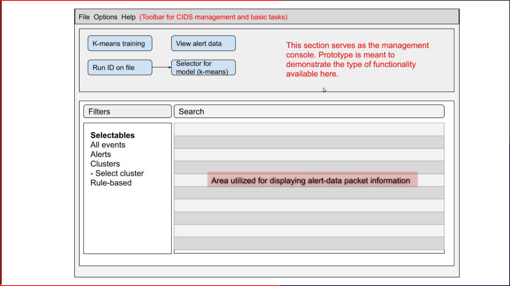
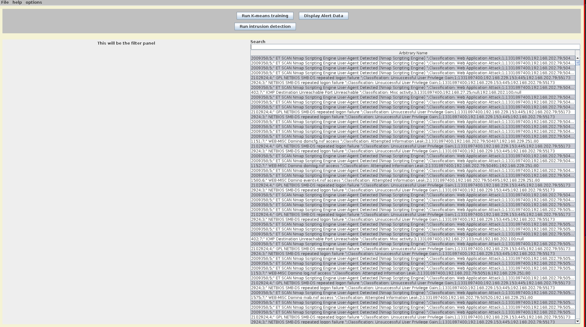
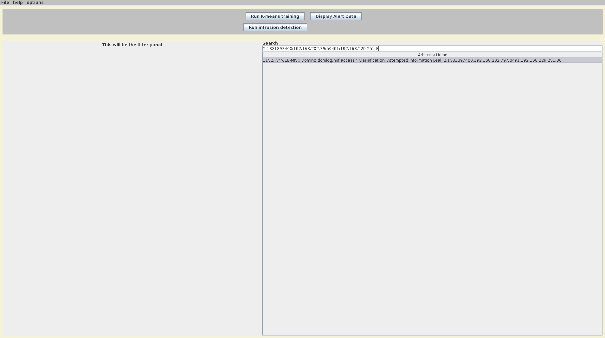

# Collaborative Intrusion Detection System Meeting Notes

## 16 September 2020

+ GUI Demonstration and Feedback:
    + The GUI for our Prototype is currently demonstrating layout, specifically our **basic** model will look similar to a **SIEMS** tool. Our scratch-up is below:

    

    + Our initial "prototye" is shown below. The prototype is meant to demonstrate three user areas:
        1. Action panel (north). This is where the user selects actions to execute.
        2. Filter panel (bottom left). This is where the user will select filters, clusters, etc to display on the right hand side.
        3. Packet panel (bottom right). This is where the data packets will be displayed. This is not currently broken into fields, but will be.

    
    

    + Instructor feedback:
        + Separate clusters by color in the data panel
        + Data should be able to come from multiple sources
        + Be able to connect to other users. TCP/IP
+ Differential privacy review
    + Achieved via addition of random noise
    + Benefit -- provably secure
+ Research discussion
    + In k-prototype, centroid of a cluster = mean of numerical attributes, most frequent value for categorical attributes
    + Secret sharing on Categorical attributes is expensive
    + Can we do differential privacy on categorical attributes?
    + Each party applies a differential privacy algorithm to replace the categorical attributes with a noisy version of categorical attribute values. Categorical attributes have been protected by differential privacy
    + Run the secret sharing algorithm to do k-prototype clustering , but only do secret sharing on numerical attributes, for categorical attributes, just use the noisy value without encryption. When you compute new cluster center, use secret share for numerical attributes. For categorical, you compute the most frequent value in each cluster without secret share.

## 09 September 2020

+ Improve implementation on categorical attributes (this is the bottleneck in latest implementation)

+ Combine differential privacy with secure sharing to achieve better efficiency (differential privacy is more efficient but less accurate due to noise added)
    + [Homomorphic Encryption](research/When_Homomorphic_Cryptosystem_Meets_Differential_Privacy.pdf)
    + [Summary of Homomorphic Differential Privacy](https://docs.google.com/document/d/19XImfqUX-phXZn_5oWGkPs97NRoG7dks_SjsjLCiTSo/edit?usp=sharing)
    + [Differential Privacy Tutorial](research/differential_privacy_tutorial.pdf)

+ Privacy preserving solutions to other collaborative IDS tasks, e.g., rule-based, sequence-based. Currently we only do clustering of similar alerts but users can use more complex rule/sequential patterns. E.g., to identify a compromised machine used to launch attacks. (so there will be two alerts, first showing attack on the machine, second showing attack launched by that machine).  

+ Implement a GUI that allow users to detect IDS collaboratively and visualize results. It may look similar to SIEM tools. The following link give you some idea common SIEM tools 

+ Functional Requirements, in short:
    + Improve implementation
    + Implement differential privacy
        + Combine with secret sharing
    + Pattern based to determine attacks
        + Rule based
    + Snort alerts
        + Different data sets
        + Security data set repository
    + GUI
        + Take the low level alerts as input
        + Take the sensors and file as input
        + Tasks and result of tasks
        + Display super alerts
        + Same interfaces for everyone
            + Communicating with peers
