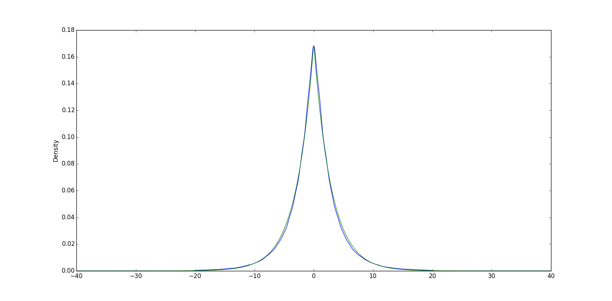

# Review of current state

To begin, it may be useful to understand and review what we've done so far. Our
current implementation is simply k-prototypes, a modification of k-means:

+ [K-means refresher video](https://www.youtube.com/watch?v=4b5d3muPQmA):
  Remember, k-means simply assigns random (or not-so-random) cluster
  centroids to start, assigns data points to the centroids nearest them (by
  Euclidean distance), finds the mean of the points assigned to a centroid, and
  resets the "center" to the mean. Then repeat this process until the centroid
  centers stop moving significantly, or "converge."

+ K-prototypes is basically the same thing, but with a slight tweak. In
  k-means, the *mean* is possible because the data is numerical. Remember, the
  mean is found between all data assigned to one cluster. The data was assigned
  to a cluster because their similarity (Euclidian distance) was closest to
  that cluster. Sometimes, data cannot be numerical. For non-quantitative data,
  aka qualitative data, the similarity metric is simply a check to see if the
  two qualitative data points are an exact match or not. Then, the
  centroid is assigned to the mean (the average of the data) and the centroid
  is assigned the qualitative attribute most frequently found in its dataset
  (the mode).
  + It is not clear to me how k-prototypes reassigns entities based on their
    categorical attributes.

+ Reviewing our Java implementation for better code understanding:
    + Entity: this class represents a horizontal partition of data (i.e., one
      IP address, one timestamp, etc). It is made up of qualities
      (quantitative) and categories (qualitative, but assigned an
      integer ID). We also use one random entity to represent the centroid.
    + EntityCluster: entity cluster is a group of entities assigned to one cluster.
    + Sharing entity: Entity data shared b/w clients.

+ Note **This implementation is not secure**, hence the introduction of Secret Sharing

# Introducing Secret Sharing

There are several secret data features which we should not want to share with
our collaborators. To review: IP addresses, timestamps, and the modes of the
categorical data features. 

In order to maintain privacy, each party splits
their data into random shares and sends a share to each other party. By itself,
a share is not enough to infer about the originators data. Once each party has
a share from every party, an intermediary sum is calculated of all the parties
shares. Then, each party shares the intermediary sum with every other party.
Every party now has the intermediary sums, which are added together to produce
a new cluster centroids. The process is repeated until centroids converge.

# Differential Privacy Background

Differential privacy serves as another means of maintaining privacy of shared
data via added noise. Notably, it is becoming a *de facto* standard for data
sharing. The basic assumption is that the exact data is not required, just
something close which produces similar results. Further, the exact data is not
something you want to share, as it is private.

+ Here is some useful background reading to get up to speed: 
    + Read the whole thing: [Medium Intro to Differential Privacy](https://medium.com/georgian-impact-blog/a-brief-introduction-to-differential-privacy-eacf8722283b)
    + Read the first few dropdowns: [Harvard Diff Privacy](https://privacytools.seas.harvard.edu/differential-privacy) 

The simplest example I can think of: I have a number 4.2121. I want to share this
with you--but only enough so that you know my numer is around around 4.2.
I don't want you to know my number is 4.2121. Enter laplace



This is a laplace distribution. Notice that if you were to take 1000 random
points from under this laplace curve, they would approximately average to 0.
So, what I can do is take 1000 random points from under the laplace curve, add
4.2 to them, and now the data approximately averages to 4.2. I can share this
new dataset with you, and you understand my data--the data indicates 4.2. You never
need to know I have 4.2121.

This is, however, a naive example. In actual usage, you are not necessarily
picking from a laplace distribution. Instead, you can follow a procedure that
introduces randomness. The results can be interpolated later on to approximate
the value intended to be shared.

I recommend reading the introduction of the following paper, which we heavily
rely on. It provides a method for frequency estimation. This relates to our
work, because we want to share the frequency of certain attributes.

+ [sec17](research/sec17-wang-tianhao.pdf)
+ In particular, note the following specific steps:
    + Encode the answer (what we want to share)
    + Randomize the encoded value to get an output
    + Share the output with an aggregator
    + Aggregator decodes the value to obtain an estimate

## Getting in the weeds

Presumably, differential privacy can be combined with secret sharing for
additional security. The premise is that I would use differential privacy on my
dataset to add noise to the horizontally partitioned data. Then, the data can be
split into shares, and additive secret sharing can be implemented with
k-prototypes to produce identical cluster centroids for everyone.

**The process:**

+ With Unary Encoding from [sec17](research/sec17-wang-tianhao.pdf):
    + An input v is encoded as a length-d bit vector, with only the bit
      corresponding to v set to 1. Here two key parameters in perturbation are p, the probability that 1 remains 1 after perturbation, and q, the probability that 0 is perturbed into 1. Depending on their choices, we have two protocols, SUE and OUE
      + Symmetric Unary Encoding: p+q=1; Basic RAPPOR protocol
      + Optimized Unary Encoding: optimized choices of p and q; proposed in the paper

Assuming we use v, the methodology follows:

1. Encoding: given value v, encode in a binary vector
    + Example: Assuming a categorical trait is assigned integer 6 

```
Encode(6) = [0,0,0,0,0,0,1,0,0,0]
This is now called B
B[v] = 1
Any other index = 0
```

2. Perturbing: Perturb(B) produces B'
    + For each bit in B, if B[i] = 1, for some prob p leave it as 1; otherwise, change to 0
    + For each bit in B, if B[i] = 0, for some prob q set the bit to 1;
      otherwise, change to 0
    + This of course requires a p and q; $p = 1/2$ and $q=1/(e^\epsilon+1)$
        + Found in [sec17](research/sec17-wang-tianhao.pdf)
    + $\epsilon$ is a privacy budget -- we need to determine how to set it.

3. Share with aggregator -- just send to server

4. Decode values and estimate. Still need to understand:
    + From Dr. Chen:

> To estimate frequency of v over perturbed value, count #of times v is one in
> perturbed value, let it be count(v'). However even if a value v appears in all
> rows, its probability of set to 1 is only p. And a non v value has
> a probability of q being set to v. So we need to adjust for this bias. The real
> count can be estimated as (count(v') - nq)/(p-q) (see equation 1 on [page 6](research/sec17-wang-tianhao.pdf) to adjust for perturbation).

## Assumptions and questions:

1. Will the server or each individual be the aggregator?
2. This only works for categorical attributes, who depend on frequency for the
   mode. This would not work for quantitative attributes, which depend on the
   mean.
